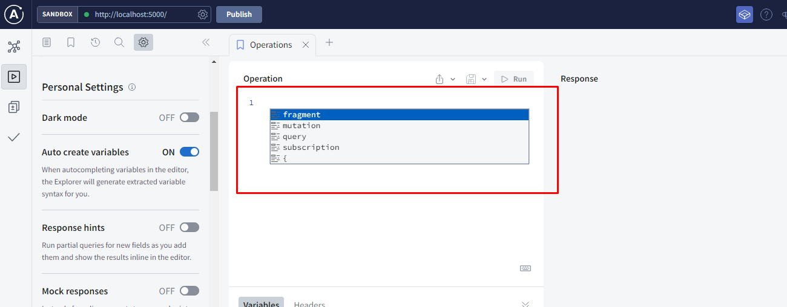

# Schema Definition Language

We'll start writing our first GraphQL server. We'll expose an API over HTTP, that is by far the most common way to use GraphQL. And we'll do that using Apollo Server, Â that is a project that makes it easy to set up a GraphQL server in JavaScript with Node.js.

- create a folder named "SERVER" and add a package.json and install apollo server with graphql query language using

```
npm install apollo-server graphql
```

- install 'graphql extension'

- server.js

```
import { gql } from "apollo-server";

const typeDefs = gql`
  type Query {
    greeting: String
  }
`;

console.log(typeDefs);

```

- Run the server with node using ` node server.js` under ./SERVER Folder

---

# Resolver Functions

- Resolver objects needs to match the structure of our type definitions

```

const resolvers = {
  Query: {
    greeting: () => "Hello World!",
  },
};

```

- Now importing the Apollo Server
  `import { ApolloServer, gql } from "apollo-server"`;

```
const server = new ApolloServer({ typeDefs, resolvers });

server.listen({ port: 5000 });
```

- .listen() returns a promise so we await it.

```
const { url } = await server.listen({ port: 5000 });
console.log(`Server running at ${url}`);

```

- FINAL CODE in server.js

```
import { ApolloServer, gql } from "apollo-server";

const typeDefs = gql`
  type Query {
    greeting: String
  }
`;

console.log(typeDefs);

const resolvers = {
  Query: {
    greeting: () => "Hello World!",
  },
};

const server = new ApolloServer({ typeDefs, resolvers });

const { url } = await server.listen({ port: 5000 });
console.log(`Server running at ${url}`);

```

** RUNNING GRAPH QL SERVER **

- Now start the server in terminal in SERVER folder with ` node server.js`
- O/p: `Server running at http://localhost:5000/`

---

# Query Language

- When you click on `http://localhost:5000/ ` it will open to
  apollo local server, click on 'query your server' it will redirect to `https://studio.apollographql.com/sandbox/explorer`

- Enter the ctrl+space give different items like fragment, query, mutation and subscription



Proper Query and Response:


Error and Response:


Optional


By default it will consider the type 'Query' as 'query' but we can define inside the schema {} as below


Everything in one go


# GraphQL Request when sent over HTTP

- Client posts some json and the server posts back the json


Payloads


Response from the server

- We got status Code : 200 OK in 'headers' at 'general' meaning it is successfull
- So the response will be as shown below:


# GraphQL Client
